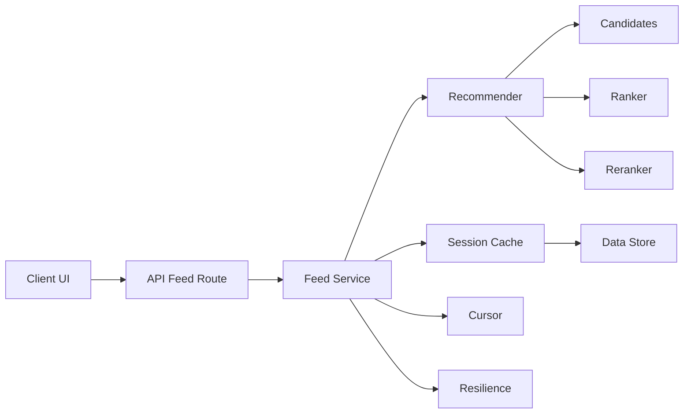
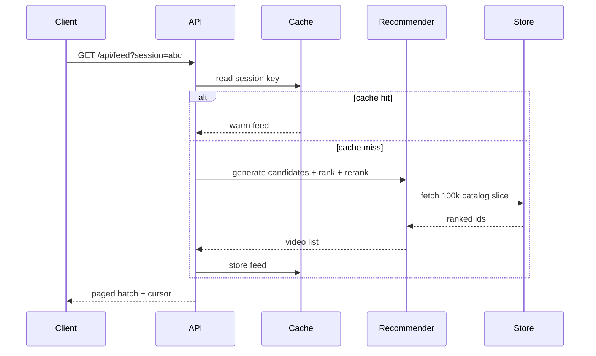

# Endless architecture

## Sequence diagrams

## Data model

- Video: id, title, creatorName, category, views, likes, durationSec, quality, topicVector(16), thumbSeed
- Session: interest profile over 12 categories and feedVersion
- Cursor: sid, offset, feedVersion, lastScore, issuedAt, signature

## Scale estimates

- 100k videos stored in memory: roughly tens of MB
- 1,500 candidate set per request
- 20-item page payload in a single response
- 15 minute sliding TTL per session cache

## Trade-offs

| Decision | Benefit | Trade-off |
|---|---|---|
| Freshness vs hit rate | warm cache reduces latency | stale interest tuning can lag |
| Personalization vs latency | strong relevance from profile | recomputation cost rises |
| Memory per session | low overhead and quick access | many sessions increase RAM |
| In-memory vs Redis | simple and low-latency | not durable or shared across nodes |
| Sticky sessions | strong locality | uneven load balancing |

## Why cursor beats offset

Offset pagination is expensive on large datasets because servers must scan from the start of the collection. A cursor provides a signed opaque token referencing a stable position and last score, so the next page can continue without re-reading the entire dataset.
